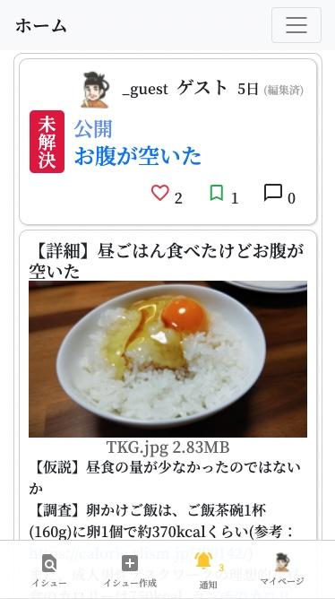
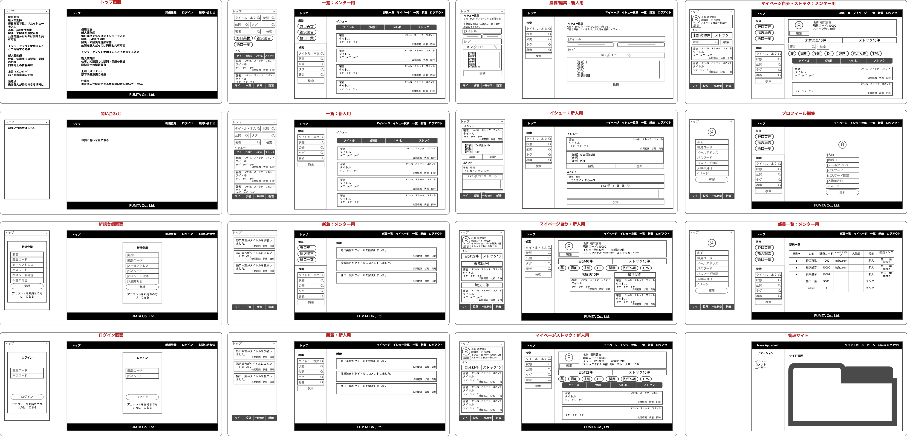
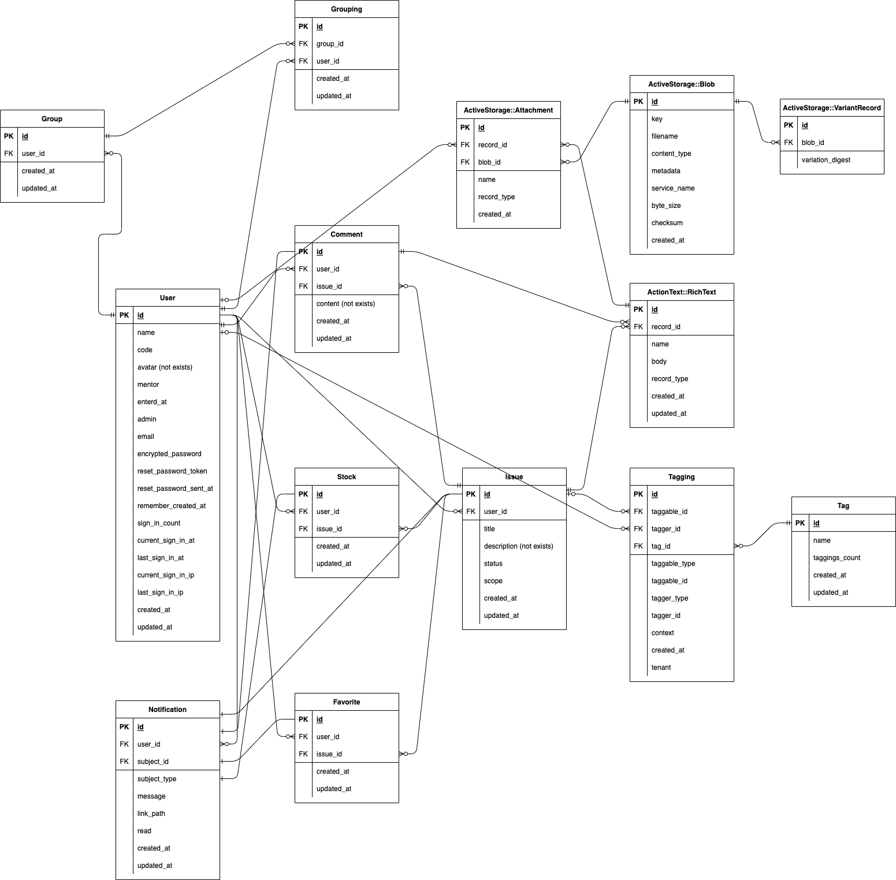
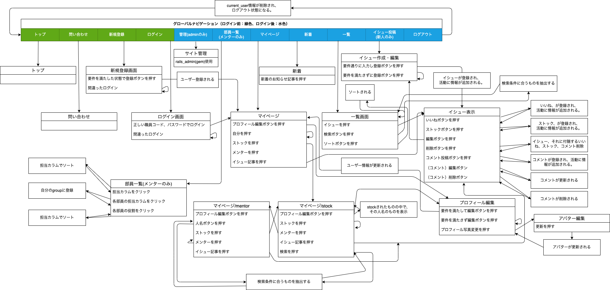

# 意習(issue)

公開URL:



## 新着

- action cableを用いたリアルタイムチャット機能（ドラフト版）追加しました: 2022/05/19


## 意習(issue)とは

仕事をする上で、問題解決能力は重要ですが、それを日々の業務だけで身につけることは難しい。社会人1年目（薬剤師）の問題<strong>意</strong>識・問題解決の<strong>習</strong>慣化と情報共有を補助するツールとしてこのアプリを作りました。 日頃の業務の中で遭遇するイシューをアウトプットし、新人同士で情報共有することで問題意識と解決能力を養います。日誌、日報とせず、イシューとすることで、問題意識を持たせることができると考えました。 ユーザーは、薬剤師のメンターと新人薬剤師を想定しています。 イシューを投稿し、コメントすることができます。また、解決・未解決の分類があり、メンターは未解決のイシューをフォローしたり、解決の方法に問題ないかチェックできます。

## 開発環境（言語）

- ruby 3.0.1
- rails 6.0.3
- jQuery 3.5.1
- Vue.js 2.6.14
- Bootstrap 4.5.0
- popper.js 1.16.0
- postgreSQL 14.2

## インフラ

- AWS S3
- Heroku
- SendGrid
- docker

## 技術

### ruby gem

- actioncable
- actiontext
- activerecord-import
- acts-as-taggable-on
- aws-sdk-s3
- bullet
- cancancan
- devise
- kaminari
- rails_admin
- ransack
- rspec-rails
- whenever

### javascript

- Vue.js(タグの入力フォームのみ)
  - Vue-multiselect
- jQuery
  - jscroll

### その他

- wheneverを用いて以下を毎日定期実行
  + attachされていないファイルの削除(作成日が1日前)
  + 28日以上経過した通知の削除

## 主な機能

- ユーザー機能
  * ユーザー作成/編集
  * ユーザーデータのcsvインポート
  * ユーザーログイン / ログアウト
  * 管理者

- イシュー投稿機能
  * 作成/編集/削除
  * リッチテキストでの投稿
  * 公開範囲設定
  * 動的タグ付

- 検索・ソート機能
  * ユーザーの検索、ソート
  * イシューの検索、ソート

- コメント投稿機能
  * 作成/編集/削除
  * リッチテキストでの投稿

- いいね、ストック機能
  * 作成/削除

- チャット機能（ドラフト版）
  * リアルタイムチャット機能

## 実行手順
以下は全てターミナルでの操作になります。
最初にアカウント登録したユーザーに管理者権限が付与されます。

```
$ git clone https://github.com/fumtas1k/issues_app.git
$ cd issues_app
$ docker-compose up
```

issues_db, issues_web, issues_webpackerが起動した後、新たなターミナルで以下を実行

```
$ docker-compose run web rails db:create db:migrate
```

ダミーデータが欲しい場合は、以下を実行

```
$ docker-compose run web rails db:seed
```

## カタログ設計

https://docs.google.com/spreadsheets/d/1TkFKai1BwqkoukUsm8eNM-FI5RmXw8tFM69eKMoSiRY/edit#gid=782464957

## テーブル定義書

https://docs.google.com/spreadsheets/d/1TkFKai1BwqkoukUsm8eNM-FI5RmXw8tFM69eKMoSiRY/edit#gid=2020033787

## ワイヤーフレーム

https://cacoo.com/diagrams/m03GB5prFCD9g9ma/CA3E3



## ER図



## 画面遷移図


