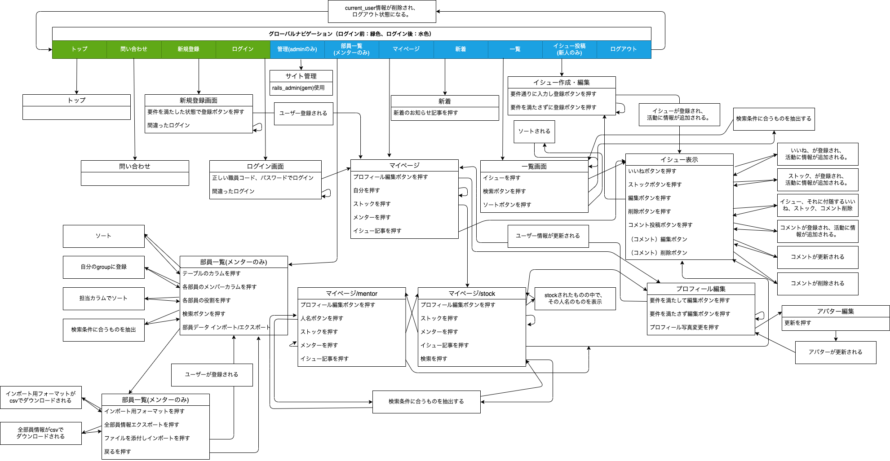

# 意習(issue)

公開URL:


## 新着

- action cableを用いたリアルタイムチャット機能（ドラフト版）追加しました: 2022/05/19


## 意習(issue)とは

仕事をする上で、問題解決能力は重要ですが、それを日々の業務だけで身につけることは難しい。社会人1年目（薬剤師）の問題<strong>意</strong>識・問題解決の<strong>習</strong>慣化と情報共有を補助するツールとしてこのアプリを作りました。 日頃の業務の中で遭遇するイシューをアウトプットし、新人同士で情報共有することで問題意識と解決能力を養います。日誌、日報とせず、イシューとすることで、問題意識を持たせることができると考えました。 ユーザーは、薬剤師のメンターと新人薬剤師を想定しています。 イシューを投稿し、コメントすることができます。また、解決・未解決の分類があり、メンターは未解決のイシューをフォローしたり、解決の方法に問題ないかチェックできます。

## 開発環境（言語）

- ruby 3.0.1
- rails 6.0.3
- jQuery 3.5.1
- Vue.js 2.6.14
- Bootstrap 4.5.0
- popper.js 1.16.0
- postgreSQL 14.2

## インフラ

- AWS S3
- SendGrid
- docker

## 技術

### ruby gem

- actioncable
- actiontext
- activerecord-import
- acts-as-taggable-on
- aws-sdk-s3
- bullet
- cancancan
- devise
- kaminari
- rails_admin
- ransack
- redis (>= 3, 5 <)
- rspec-rails
- sendgrid-ruby
- whenever

### javascript

- Vue.js(タグの入力フォームのみ)
  - Vue-multiselect
- jQuery
  - jscroll

### その他

- wheneverを用いて以下を毎日定期実行
  + attachされていないファイルの削除(作成日が1日前)
  + 28日以上経過した通知の削除

## 主な機能

- ユーザー機能
  * ユーザー作成/編集
  * ユーザーデータのcsvインポート
  * ユーザーログイン / ログアウト
  * 管理者

- イシュー投稿機能
  * 作成/編集/削除
  * リッチテキストでの投稿
  * 公開範囲設定
  * 動的タグ付

- 検索・ソート機能
  * ユーザーの検索、ソート
  * イシューの検索、ソート

- コメント投稿機能
  * 作成/編集/削除
  * リッチテキストでの投稿

- いいね、ストック機能
  * 作成/削除

- チャット機能（ドラフト版）
  * リアルタイムチャット機能

## docker構成

| サーバー名 | 用途 |
|---|---|
| **db** | データベース用 |
| **web** | アプリケーション用 |
| **webpacker** | webpackのコンパイル用 |
| **minio** | ストレージ（S3互換）用 |
| **mc** | minioの初期設定用 |
| **redis** | アクションケーブル(チャット)で使用するインメモリDB |

## 実行手順

以下は全てターミナルでの操作になります(macでの操作)。

**1. hostsの追加**

    まず、S3の代わりにdockerでminioを使用するため、minioのIPアドレスを読み替える必要があります。
    webサーバーからは `http://minio:9000` でminioサーバーにアクセスしますが、ブラウザからは `http://localhost:9000` でアクセスするため、そのままでは保存した画像が表示できなかったり直接のアップロードができなかったりします。

    ```plain text
    $ sudo vi /etc/hosts
    ```
    パスワード入力が必要になります。
    パソコンログイン時のパスワードを入力して下さい。

    ファイルの中身が表示されたら、`i` キーを押して、編集できるようにします。
    最終行の下に以下を追加。

    ```plain text
    127.0.0.1 minio
    ```
    `esc` キーを押して編集を終了し、`:wq`と入力し、エンターキーを押すと保存されます。これで、下準備完了です。

**2. 環境構築**

    ```plain text
    $ git clone https://github.com/fumtas1k/issues_app.git
    $ cd issues_app
    ```

    環境変数は`issues_app`ディレク直下に`.env`ファイルを作成し、以下を埋めて下さい。`SENDGRID_API_KEY`はSEND GRIDに登録し、API KEYを入手して下さい（メール登録しなくても使用可能です）。EMAILはご自分のメールアドレスを入力して下さい。

    ```plain text
    SENDGRID_API_KEY =
    SENDGRID_API_HOST = https://api.sendgrid.com
    EMAIL =
    ```

    `.env` ファイルの設定が終わったら以下を実行。

    ```plain text
    $ docker-compose up -d
    ```

    全てが立ち上がったら使用可能となります。
    `http:127.0.0.1:3000` にアクセスして下さい(最初に立ち上げた時は、データベースの初期化等で時間がかかります)。

**3. ダミーデータ**

    ダミーデータが欲しい場合は、ターミナルで以下を実行

    ```plain text
    $ docker-compose run web rails db:seed
    ```

**4. サーバー内での作業**

    dockerのwebサーバー内で作業したい場合は、ターミナルで以下を実行(他のサーバーに入りたい場合はwebの部分をdb, minio等に変更)。

    ```plain text
    $ docker-compose exec web bush
    ```
**5. 停止したい場合**

   ```plain text
   $ docker-compose stop
   ```

なお、このアプリは、最初にアカウント登録したユーザーに管理者権限が付与されます。

## 削除手順

一括削除するには、以下のコマンドをターミナルで実行。
コンテナ、イメージ、ボリューム、ネットワークが削除されます。

```plain text
$ docker-compose down --rmi all --volumes --remove-orphans
```


## カタログ設計

https://docs.google.com/spreadsheets/d/1TkFKai1BwqkoukUsm8eNM-FI5RmXw8tFM69eKMoSiRY/edit#gid=782464957

## テーブル定義書

https://docs.google.com/spreadsheets/d/1TkFKai1BwqkoukUsm8eNM-FI5RmXw8tFM69eKMoSiRY/edit#gid=2020033787

## ワイヤーフレーム

https://cacoo.com/diagrams/m03GB5prFCD9g9ma/CA3E3


## ER図


## 画面遷移図


