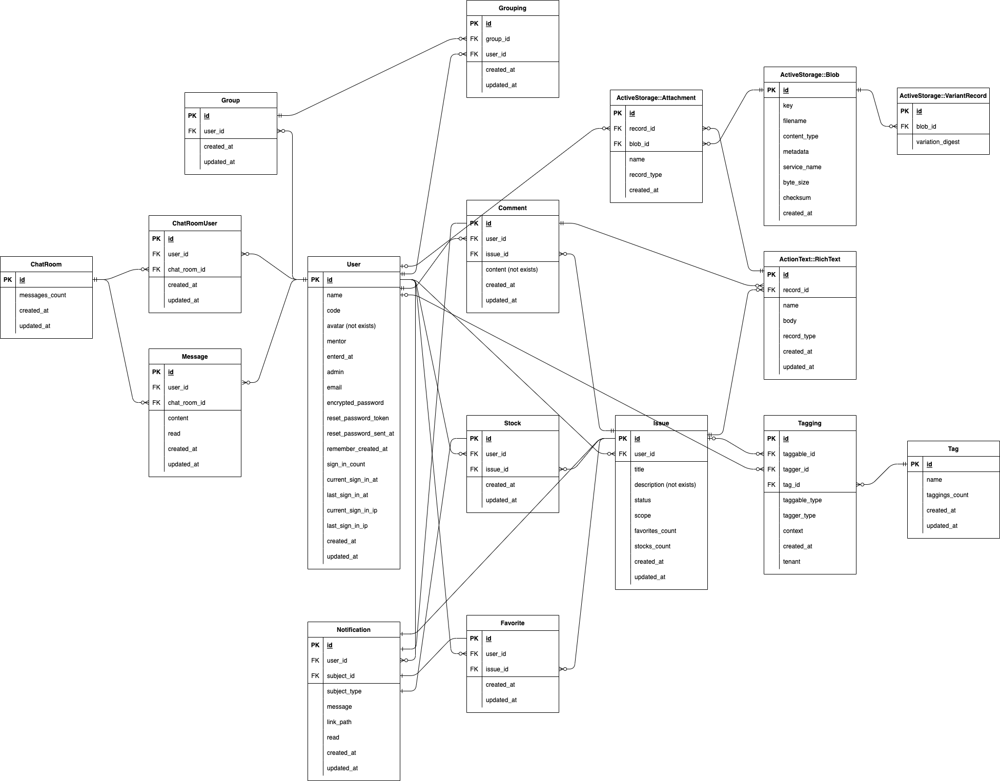

# README
【アプリケーション名】意集(issue)
公開URL: 未完成

## 意集(issue)とは

仕事をする上で、問題解決能力は重要だがそれを日々の業務をこなすだけで身につけることは難しい。
前職の教育担当より依頼され、社会人1年目（薬剤師）の問題解決の習慣化と情報共有を補助する目的でこのアプリを作りました。
日頃の業務の中で遭遇するイシューをアウトプットし、新人同士で情報共有することで問題意識と解決能力を養います。日誌、日報とせず、イシューとすることで、問題意識を持たせることができると考えられます。
ユーザーは、薬剤師のメンターと新人薬剤師を想定しています。
イシューを投稿し、コメントすることができます。また、解決・未解決の分類があり、メンターは未解決のイシューをフォローしたり、解決の方法に問題ないかチェックできます。

## 開発環境（言語）

- ruby 3.0.1
- rails 6.0.3
- jQuery 3.5.1
- Bootstrap 4.5.0
- popper.js 1.16.0

## インフラ

- AWS S3
- Heroku
- SendGrid

## 就業Term技術

- devise(gem)
-  Ajaxを使ったコメント機能
- お気に入り機能

## カリキュラム以外の技術

### ruby gem

- action text
- activerecord-import
- acts-as-taggable-on
- active storage
- ransack

### javascript

- vue.js(タグの入力フォームのみ)
  - vue-multiselect
- jQuery
  - jscroll

### 定期実行

- heroku scheduler

## 主な機能

- ユーザー機能
  * ユーザー作成/編集
  * ユーザーデータのcsvインポート
  * ユーザーログイン / ログアウト
  * 管理者

- イシュー投稿機能
  * 作成/編集/削除
  * リッチテキストでの投稿
  * 公開範囲設定
  * タグ付

- 検索・ソート機能
  * ユーザーの検索、ソート
  * イシューの検索、ソート

- コメント投稿機能
  * 作成/編集/削除
  * リッチテキストでの投稿

- いいね、ストック機能
  * 作成/削除


## 実行手順
以下は全てターミナルでの操作になります。
最初にアカウント登録したユーザーに管理者権限が付与されます。
なお、管理者及びメンターはイシューの作成ができません。

```
$ git clone https://github.com/fumtas1k/issues_app.git
$ cd issues_app
$ bundle install
$ yarn install
$ rails db:create && rails db:migrate
$ rails s
```

本アプリには、ImageMagickが必要です。
インストールされていない場合は、以下を実行して下さい。

**Macの場合**

```
$ brew install imagemagick
```

**Windowsの場合(WSL2)**

```
$ sudo apt install imagemagick
```

## カタログ設計

https://docs.google.com/spreadsheets/d/1TkFKai1BwqkoukUsm8eNM-FI5RmXw8tFM69eKMoSiRY/edit#gid=782464957

## テーブル定義書

https://docs.google.com/spreadsheets/d/1TkFKai1BwqkoukUsm8eNM-FI5RmXw8tFM69eKMoSiRY/edit#gid=2020033787

## ワイヤーフレーム

https://cacoo.com/diagrams/m03GB5prFCD9g9ma/CA3E3


## ER図



## 画面遷移図


